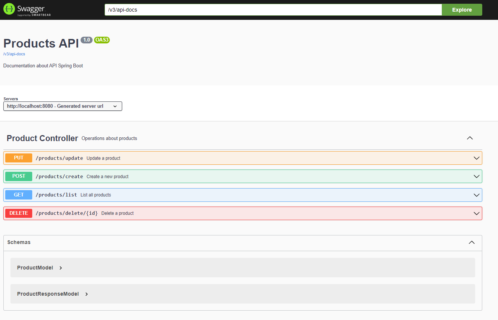

# ProductsAPI
API developed using Spring and documented by Swagger

After execute the application is possible see and test API Endpoints:
- http://localhost:8080/swagger-ui/index.html#/

## Requirements
 - Maven
 - Spring Boot
 - Java 17
 - MySQL

## Endpoints
  

